<!-- Typing SVG header -->
<p align="center">
  <a href="https://github.com/VamsidharPoothi">
    
  </a>
</p>

<p align="left">
  
</p>

## 🧑‍💻 About Me

> 🚀 I don't just write code — I build systems that stay up when everything else falls apart.

Senior Software Engineer with **5+ years** building fault-tolerant, high-availability distributed systems at production scale.

> 🌐 **Portfolio:** `coming soon` — building with [Claude Code](https://claude.ai/code) 🚀

```
📍 Dallas, TX, USA
🏢 Ex-Microsoft | Ex-Paycom
📫 Reach me: vamsidhar.reddy1207@gmail.com
🎓 M.S. Computer Science — Texas Tech University (GPA: 4.0/4.0)
🎓 B.Tech. Computer Science — Andhra University (GPA: 8.0/10.0)
⚙️ Specialization: Distributed backend Systems, Fault-Tolerant Architecture, Cloud-Native
```
## 💼 Open To
Mid-level/Senior SWE roles focused on **distributed systems**, **cloud-native backend**, or **platform engineering**.  
Remote-friendly. Based in Dallas, TX. (Open to relocate within US)

---

### Verified Badges
 
<p align="left">
  <a href="https://learn.microsoft.com/api/credentials/share/en-us/VamsidharReddyPoothi-1958/6E4D70BBEF57DA9E?sharingId=B2BCA2C0AFFE25D6" target="_blank">
    
  </a>
  
  <a href="https://learn.microsoft.com/api/credentials/share/en-us/VamsidharReddyPoothi-1958/EE6F0DC23A86534D?sharingId=B2BCA2C0AFFE25D6" target="_blank">
    
  </a>
  
  <a href="https://www.credly.com/badges/d9074046-9bf0-4f0a-9091-ecccf6aaaea3/public_url" target="_blank">
    
  </a>
  
  <a href="https://www.credly.com/badges/23516378-d46d-418f-81b1-833058a76802/public_url" target="_blank">
    
  </a>
</p>

---
## ⚡ Fun Fact

> _I moved from India to Texas, scored a 4.0 MS GPA, and still find time to grind LeetCode at midnight._

---
## 🧠 Currently Obsessing Over
- How agentic AI systems fail gracefully (or don't)
- The gap between "certified in cloud" and "architecting for production."  
- Why distributed systems are just trust issues with computers

---

## 💥 By the Numbers
> Real production impact, not classroom simulations.

| 🖥️ Prod Servers Managed | ⚡ MTTD Improvement | 📈 App Perf Boost | 🛡️ Vulnerabilities Remediated |
|:-:|:-:|:-:|:-:|
| **1,300+** | **20%** | **25%** | **98% of 12,000** |

---

## 🔭 What I'm Up To

- 🏗️ **Building** — Personal portfolio site _(shipped with Claude Code, coming very soon!)_
- 📚 **AWS Dev Associate** — targeting cert by July 2026
- ⚔️ **NeetCode 150** — halfway through blind 75
- 🌱 **Exploring** — LLM tooling, AI infra, and agentic systems
  


---

## 🛠️ Tech Stack

**Core:**
`C# / .NET Core` `Java` `Python` `TypeScript` `JavaScript (ES6+)` `C++`

**Cloud & Infrastructure:**
`Azure` `AWS` `Kubernetes (AKS)` `Docker` `IaC` `Redis` `CosmosDB` `Blob Storage` `Key Vault`

**Security:**
`OAuth 2.0` `JWT` `MSAL` `Proof-of-Possession (PoP)` `mTLS` `NSG`

**DevOps & Observability:**
`CI/CD` `Azure DevOps` `YAML Pipelines` `Grafana` `Application Insights`

**Databases:**
`SQL Server` `PostgreSQL` `MySQL` `Redis` `CosmosDB`

**Frontend:**
`React` `Node.js`

---
## ☁️ Cloud Certifications

| Badge | Certification | Status |
|-------|--------------|--------|
| ✅ | [Microsoft Azure Fundamentals (AZ-900)](https://learn.microsoft.com/api/credentials/share/en-us/VamsidharReddyPoothi-1958/6E4D70BBEF57DA9E?sharingId=B2BCA2C0AFFE25D6) | Certified |
| ✅ | [Microsoft Azure AI Fundamentals (AI-900)](https://learn.microsoft.com/api/credentials/share/en-us/VamsidharReddyPoothi-1958/EE6F0DC23A86534D?sharingId=B2BCA2C0AFFE25D6) | Certified |
| ✅ | [AWS Certified Cloud Practitioner](https://www.credly.com/badges/d9074046-9bf0-4f0a-9091-ecccf6aaaea3/public_url) | Certified |
| ✅ | [AWS Certified AI Practitioner](https://www.credly.com/badges/23516378-d46d-418f-81b1-833058a76802/public_url) | Certified |
| ⏳ | AWS Certified Developer – Associate | In Progress |

---

## 📈 GitHub Stats
<!-- These SVGs are auto-generated daily by GitHub Actions — no broken external links -->
<p align="center">
  
  
</p>

<p align="center">
  
  
</p>

<p align="center">
  
</p>

---

## 🔗 Let's Connect

<p align="left">
  <a href="https://linkedin.com/in/vamsidhar-reddy-poothi">
    
  </a>
  <a href="https://leetcode.com/u/Vamsidhar12/">
    
  </a>
  <a href="https://mail.google.com/mail/?view=cm&to=vamsidhar.reddy1207@gmail.com" target="_blank">
    
  </a>
  <a href="https://github.com/vamsidhar12/vamsidhar12/raw/main/Vamsi_Resume.pdf">
    
  </a>
</p>
